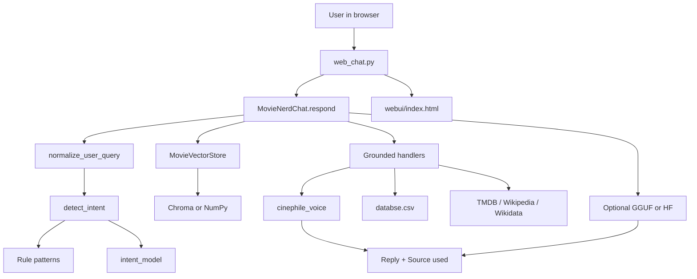

# Mr. Cinephile (CinéBot) — Project Documentation

A local **movie-enthusiast chatbot** that combines **retrieval-augmented generation (RAG)** over your movie catalog with an optional **fine-tuned small language model (SLM)** for open-ended conversation. The web UI is branded **Mr. Cinephile**; shared prompts and phrasing live in **`cinephile_voice.py`**.

**Core goals:**

1. **Grounded facts** — Titles, years, directors, plots, and ratings come from your CSV, retrieved context, or verified web APIs — not invented from model memory.
2. **Cinephile voice** — Warm, opinionated, film-buff tone (casual cadence, light British flavour) on grounded answers and in SLM prompts — never dry encyclopaedia prose.

---

## Table of contents

1. [High-level architecture](#high-level-architecture)
2. [Repository layout](#repository-layout)
3. [Voice and persona (`cinephile_voice.py`)](#voice-and-persona-cinephile_voicepy)
4. [Data layer](#data-layer)
5. [Vector store and retrieval](#vector-store-and-retrieval)
6. [Intent routing](#intent-routing)
7. [Query processing and answer paths](#query-processing-and-answer-paths)
8. [Web application](#web-application)
9. [Training pipelines](#training-pipelines)
10. [Training time estimates](#training-time-estimates)
11. [QLoRA: GPU vs CPU (training and merge)](#qlora-gpu-vs-cpu-training-and-merge)
12. [External services and fallbacks](#external-services-and-fallbacks)
13. [Configuration and secrets](#configuration-and-secrets)
14. [Setup guide](#setup-guide)
15. [Anti-hallucination behavior](#anti-hallucination-behavior)
16. [Troubleshooting](#troubleshooting)
17. [Changelog (recent)](#changelog-recent)

---

## High-level architecture

| Layer | Role |
|--------|------|
| **NLU / intent** | Classifies messages (plot, cast, director, recommend, discussion) via rules + trained MLP/logistic model |
| **Vector store** | Embeds movie documents; cosine / semantic top-K per query |
| **Grounded handlers** | Deterministic answers: plot, cast, director, year, recommendations, **title disambiguation** |
| **Voice layer** | `cinephile_voice.py` wraps factual text in enthusiast phrasing |
| **Optional SLM** | Phi-3-mini or Mistral (GGUF or Hugging Face merged weights) for discussion / open chat |
| **Web UI** | FastAPI + static frontend; chat + **Retrieved Context** panel |



**Inference flow:**

1. Normalize query (typos: `plaot`→`plot`, `recomend`→`recommend`, …).
2. Detect intent (cast guard → ML classifier → rules).
3. Apply `respond()` overrides (plot → factual; director filter only when not a plot/cast question).
4. Retrieve top-K movies (full query + title-focused search).
5. If a grounded handler answers, format with **cinephile voice** and return with `Source used: …`.
6. Else build RAG prompt (`SYSTEM_PROMPT` + context) and call optional SLM.
7. Return reply + sources for the UI context panel.

---

## Repository layout

| Path | Description |
|------|-------------|
| `databse.csv` | Primary movie table |
| `movie_data.py` | CSV normalization; loads `.env` |
| `cinephile_voice.py` | **Shared persona**: system prompt + grounded reply phrasing |
| `03_rag_pipeline.py` | Vector store, intent, `MovieNerdChat`, web fallbacks |
| `web_chat.py` | FastAPI server |
| `webui/index.html` | Mr. Cinephile UI |
| `intent_classifier.py` | Loads `intent_model/` for `predict()` |
| `04_intent_dataset.py` | Builds `data/intent_labeled.jsonl` (`--hard` for traps + full CSV) |
| `train_intent_classifier.py` | `--mode fast` or `--mode hard` (MLP) |
| `train_intent.ps1` | One-shot: dataset + train |
| `00_synthetic_dataset.py` | Grounded LoRA JSONL from CSV |
| `01_generate_dataset.py` | Optional Anthropic API dataset |
| `02_train_qlora.py` | QLoRA + optional `--merge` |
| `06_merge_datasets.py` | Merge base + intent chat add-on |
| `movie_vector_store/` | Chroma and/or `np_rag/` embeddings |
| `intent_model/` | `classifier.joblib` + `meta.json` |
| `data/` | `intent_labeled.jsonl`, `intent_chat_addon.jsonl` |
| `training_data/` | Optional external intent data |
| `scripts/set_tmdb_key.ps1` | TMDB key helper |
| `DOCUMENTATION.md` | This file |
| `README.md` | Quick start |

---

## Voice and persona (`cinephile_voice.py`)

All enthusiast tone is centralized here so RAG, training, and the UI stay consistent.

### System prompt (SLM / LoRA)

Used by `03_rag_pipeline.py` (`SYSTEM_PROMPT`), `00_synthetic_dataset.py`, `01_generate_dataset.py`, and `02_train_qlora.py` fallback.

Characteristics:

- Speaks as **Mr. Cinephile** — warm, opinionated, slightly dramatic.
- Film-buff vocabulary: “worth the runtime”, “on my watchlist”, “programme for tonight”, etc.
- Light **British cadence** allowed (“brilliant”, “programme”) without heavy slang.
- Must not invent catalogue-specific facts; may express taste when not asserting DB fields.

### Grounded reply helpers

Used by `MovieNerdChat` for retrieval-only answers (no SLM required for tone):

| Helper | Use |
|--------|-----|
| `format_plot()` | Plot / about answers with intro + overview |
| `format_director()` / `format_director_web()` | Who directed … |
| `format_year()`, `format_genre()`, `format_rating()` | Metadata |
| `format_cast_lead()`, `format_character_portrayal()` | Cast questions |
| `format_disambiguation()` | Same title, multiple years |
| `recommend_heading_*()` | Recommendation list intros |
| `format_abstain()` | Refusal when unverified |

**Example (plot):**

```text
Ah — "The Girl Next Door" (2004). Luke Greenfield is behind the camera, and here's the vibe
without me spoiling the magic:

[overview]

If that synopsis clicks, it's absolutely worth the runtime.

Source used: wikipedia
```

Restart `web_chat.py` after editing `cinephile_voice.py` — no retrain needed for grounded voice changes.

**SLM / LoRA voice** requires retraining (`00_synthetic_dataset.py` → `02_train_qlora.py`) or relies on the updated `SYSTEM_PROMPT` at inference.

---

## Data layer

### Movie CSV (`databse.csv`)

Minimum columns: **title** + **overview**. Aliases normalized in `movie_data.py`:

| Canonical | Aliases |
|-----------|---------|
| `title` | `movie_title`, `name` |
| `overview` | `plot`, `summary` |
| `director` | `directors` |
| `genre` | `genres` |
| `year` | `release_year`, `release date` |
| `rating` | `vote_average`, `score` |
| `movie_id` | `id`, `tmdb_id` |

### LoRA JSONL

`00_synthetic_dataset.py` builds `instruction` / `output` rows from CSV fields only, with `system` set from `cinephile_voice.SYSTEM_PROMPT`.

---

## Vector store and retrieval

### Backends

| Backend | How to select |
|---------|----------------|
| **Chroma** | Default when installed (`--vector-backend auto`) |
| **NumPy + MiniLM** | `--vector-backend numpy` or Chroma missing |

```powershell
python 03_rag_pipeline.py --build --movies databse.csv
```

### Retrieval

- Full-query semantic search + title-focused second pass.
- `TOP_K` = 5 by default.
- `identify_primary_film()` uses token overlap, relevance score, year match, franchise boosts.

---

## Intent routing

### Collapsed intents (`MovieNerdChat.respond`)

| Intent | Fine labels | Examples |
|--------|-------------|----------|
| `factual` | `factual_plot`, `factual_cast`, `factual_director`, `factual_year`, `factual_other` | plot, cast, director, year |
| `recommend` | `recommend` | “movies by Nolan”, “best horror” |
| `discussion` | `discussion` | opinions, debates |

### Detection order

1. `is_cast_or_actor_question()` → force `factual`.
2. `intent_classifier.predict()` if `intent_model/` exists (confidence ≥ ~0.52).
3. `detect_intent_rules()` fallback.

### Critical overrides (bug fixes)

| Rule | Why |
|------|-----|
| Plot/about questions → `factual` | “plot of X” must not become recommend |
| `_extract_director_constraint()` returns `None` on plot questions | Stops “plot **of** girl next door” → director “girl next door” |
| No bare `of` in director regex | Same fix at pattern level |
| Director filter → `recommend` only when **not** plot/cast | Preserves factual plot path |

### Training

```powershell
python 04_intent_dataset.py --movies databse.csv --hard --chat-addon
python train_intent_classifier.py --mode hard --max-samples 150000
# or
.\train_intent.ps1
```

| Mode | Model | Typical CPU time |
|------|--------|------------------|
| `fast` | Logistic on MiniLM embeddings | ~5–15 min |
| `hard` | 3-layer MLP (512→256→128) | ~8–35 min (150k–293k samples) |

`--hard` dataset: all movies, typo augmentation, **25×** hand-authored traps (plot vs director vs cast, including “girl next door” / `plaot` typos).

Artifacts: `intent_model/classifier.joblib`, `intent_model/meta.json` (`model_type`: `mlp` or `logistic`).

---

## Query processing and answer paths

### Normalization and title extraction

- Typos fixed in `normalize_user_query()`.
- `_extract_movie_query_text()` understands `tell me about the plot of …`, `plot of …`, etc., so the title is **girl next door**, not “the plot of the girl next door”.

### Plot (`_answer_plot`)

| Situation | Behavior |
|-----------|----------|
| No year + **2+** same-title versions (CSV + web) | **Disambiguation** — list years, directors, blurbs; ask user to reply with year |
| Year given | Dataset match for year → else web (TMDB → Wikipedia → Wikidata) |
| No year, one clear version | Web first (popular film), then dataset; voiced via `format_plot()` |

`fetch_web_movie_candidates()` powers disambiguation (Wikipedia film pages; TMDB when keyed).

### Recommendations

Director-filtered lists with `recommend_heading_director()`; bullets use “Why I'd queue it:” instead of dry “Why:”.

### Factual / cast / director

Voiced through `cinephile_voice` helpers; Wikidata/web for cast when needed.

### Discussion + SLM

```text
SYSTEM: cinephile_voice.SYSTEM_PROMPT
USER: CONTEXT + question (+ history)
Assistant: Mr. Cinephile
```

---

## Web application

```powershell
python web_chat.py
python web_chat.py --model .\movie-nerd-lora\merged-model
python web_chat.py --model .\movie-nerd.Q4_K_M.gguf --gpu-layers 20
```

Open **http://127.0.0.1:8000**

### API

| Method | Path | Notes |
|--------|------|--------|
| `GET` | `/` | UI |
| `POST` | `/api/chat` | `X-Session-Id` for multi-turn |
| `POST` | `/api/reset` | Clear history |
| `GET` | `/api/trailer` | YouTube trailer |
| `GET` | `/api/health` | Backend status |

### UI

- Dark theme; chat + **Retrieved Context** (relevance scores).
- Greeting and reset copy in enthusiast voice.
- **Watch trailer** when `primary_film` is detected.

---

## Training pipelines

| Step | Script | Output |
|------|--------|--------|
| 0 | `00_synthetic_dataset.py` | `dataset.jsonl` |
| 1 | `01_generate_dataset.py` | API-enriched JSONL (optional) |
| 2 | `02_train_qlora.py` | `movie-nerd-lora/lora-adapter`, optional `merged-model` |
| 3 | `03_rag_pipeline.py --build` | Vector index |
| 4 | `04_intent_dataset.py` | `data/intent_labeled.jsonl` |
| — | `train_intent_classifier.py` | `intent_model/` |
| 6 | `06_merge_datasets.py` | `dataset_full.jsonl` |

### Intent-aware LoRA (optional)

```powershell
python 06_merge_datasets.py --base dataset.jsonl --addon data/intent_chat_addon.jsonl --output dataset_full.jsonl
python 02_train_qlora.py --dataset dataset_full.jsonl --output .\movie-nerd-lora --merge
```

---

## Training time estimates

Approximate on a typical desktop (your mileage varies):

| Task | CPU | GPU (8 GB+, CUDA) |
|------|-----|-------------------|
| Vector index `--build` | 5–20 min | Same |
| Intent dataset `--hard` | ~10–30 s | Same |
| Intent `fast` | 5–15 min | 5–10 min |
| Intent `hard` (150k) | **~8–15 min** | **~5–10 min** |
| Intent `hard` (full ~293k, `--max-samples 0`) | 15–35 min | 10–20 min |
| `00_synthetic_dataset.py` (full CSV) | 2–5 min | Same |
| **QLoRA train** (2 epochs, full set) | Impractical | **2–8 hours** |
| **QLoRA `--merge`** (default CPU) | 30 min–2 h | 10–30 min with `--merge-device cuda` |
| GGUF export (llama.cpp, separate) | 15–45 min | 5–15 min |

Quick QLoRA experiment:

```powershell
python 02_train_qlora.py --dataset dataset.jsonl --output .\movie-nerd-lora --epochs 1 --max-train-examples 5000
```

→ often **~30–90 min on GPU**.

---

## QLoRA: GPU vs CPU (training and merge)

```powershell
python 02_train_qlora.py --dataset dataset.jsonl --output .\movie-nerd-lora --merge
```

### Training phase

- Default backend `hf` loads the base model with **`device_map="auto"`** and **4-bit** weights (`bitsandbytes`).
- **Uses GPU when** PyTorch reports `torch.cuda.is_available()` and CUDA + bitsandbytes work.
- On start you should see: `GPU: <name> (X.X GB)`.
- **CPU-only 4-bit training is not supported** in practice — use a CUDA GPU for QLoRA.

Check GPU:

```powershell
python -c "import torch; print('CUDA:', torch.cuda.is_available()); print(torch.cuda.get_device_name(0) if torch.cuda.is_available() else 'no GPU')"
```

### Merge phase (`--merge`)

- Default: **`--merge-device cpu`** (avoids OOM on small GPUs).
- Training may run on GPU; **merge runs on CPU unless you override**.

GPU merge (12 GB+ VRAM recommended):

```powershell
python 02_train_qlora.py --dataset dataset.jsonl --output .\movie-nerd-lora --merge --merge-device cuda
```

Or `--merge-device auto` (CUDA if available, else CPU).

### Recommended command

```powershell
python 02_train_qlora.py --dataset dataset.jsonl --output .\movie-nerd-lora --model phi3-mini --backend hf --merge --merge-device cpu
```

Phi-3-mini 4-bit needs roughly **~6–8 GB VRAM** for training; Mistral-7B needs more.

---

## External services and fallbacks

| Service | Used for | Key? |
|---------|----------|------|
| **TMDB** | Trailers, plots, multi-title search | Optional `TMDB_API_KEY` |
| **Wikipedia** | Plots, disambiguation | No |
| **Wikidata** | Director, cast | No |
| **YouTube** | Trailer links | Via TMDB or search URL |

Plot lookup order: **TMDB → Wikipedia → Wikidata**.

---

## Configuration and secrets

```powershell
copy .env.example .env
# Set TMDB_API_KEY=...
.\scripts\set_tmdb_key.ps1
```

| Constant | Default |
|----------|---------|
| `CHROMA_DIR` | `./movie_vector_store` |
| `EMBED_MODEL` | `all-MiniLM-L6-v2` |
| `TOP_K` | `5` |

---

## Setup guide

1. **Venv + deps**

   ```powershell
   python -m venv .venv
   .\.venv\Scripts\Activate.ps1
   pip install -r requirements.txt
   ```

2. **Index**

   ```powershell
   python 03_rag_pipeline.py --build --movies databse.csv
   ```

3. **Intent (recommended)**

   ```powershell
   .\train_intent.ps1
   ```

4. **(Optional) LoRA persona**

   ```powershell
   python 00_synthetic_dataset.py --input databse.csv --output dataset.jsonl
   pip install torch --index-url https://download.pytorch.org/whl/cu118
   python -X utf8 02_train_qlora.py --dataset dataset.jsonl --output .\movie-nerd-lora --merge --merge-device cpu
   ```

5. **Run UI**

   ```powershell
   python web_chat.py
   ```

**Voice without LoRA:** steps 1–2 + 5 are enough; grounded answers use `cinephile_voice` immediately.

---

## Anti-hallucination behavior

1. Retrieval-first on every turn.
2. Grounded handlers before SLM generation.
3. `Source used: …` on factual replies.
4. `_abstain()` when confidence is low.
5. LoRA / synthetic data tied to CSV fields.
6. Intent traps prevent plot → director mis-routing.
7. Disambiguation when multiple films share a title (no silent wrong-year pick).

---

## Troubleshooting

| Symptom | Cause | Fix |
|---------|--------|-----|
| “directed by Girl Next Door” on plot | Old routing | Pull latest `03_rag_pipeline.py`; retrain intent; restart server |
| Wrong year (*Girl Next Door*) | Ambiguous title | Pick from disambiguation list; ask with year |
| Dry / robotic answers | Old templates | Ensure `cinephile_voice.py` present; restart `web_chat.py` |
| Open chat still dry | No LoRA / old weights | Retrain with updated `SYSTEM_PROMPT` in dataset |
| `intent_model` ignored | Missing / low confidence | Run `train_intent_classifier.py`; check `meta.json` |
| `/api/chat` 504 | Slow GGUF on CPU | `--chat-timeout`, shorter queries, or no `--model` |
| QLoRA fails on CPU | 4-bit needs CUDA | Install CUDA PyTorch + GPU |
| Merge OOM on GPU | Full merge in VRAM | Use default `--merge-device cpu` |
| No trailers | No TMDB key | `.env` + `TMDB_API_KEY` |
| Gibberish GGUF | Wrong template | `--prompt-format raw` or HF `merged-model` |

---

## Changelog (recent)

| Change | Area |
|--------|------|
| Plot vs director routing fix | `03_rag_pipeline.py` — no `of <title>` as director on plot questions |
| Multi-year **disambiguation** | `_collect_title_versions`, `fetch_web_movie_candidates` |
| **`cinephile_voice.py`** | Enthusiast tone on all grounded answers + shared `SYSTEM_PROMPT` |
| Intent **hard** training | MLP head, ~293k examples, `train_intent.ps1` |
| Title extraction / typo `plaot` | `normalize_user_query`, `_extract_movie_query_text` |
| Web-first plot when single version | Wikipedia/TMDB for popular default year |

---

## Related documents

- [README.md](README.md) — Quick start  
- [training_data/EXTERNAL_DATASETS.md](training_data/EXTERNAL_DATASETS.md) — Optional intent data  
- [blueprint.txt](blueprint.txt) — Original architecture sketch  

---

*Last updated: Mr. Cinephile voice module, intent MLP training, plot disambiguation, routing fixes, QLoRA GPU/merge notes.*
